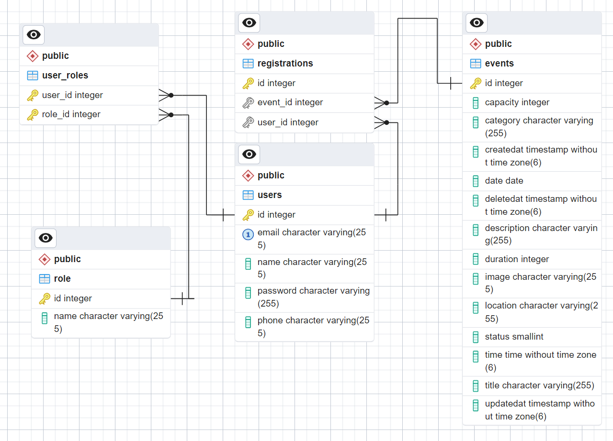

# SP2 Security Project

Morten Bomholt Mikkelsen, cph-mm769@cphbusiness.dk , GitHub:  mbm1337

Mustafa Altinkaya, cph-ma763@cphbusiness.dk , GitHub: altinkaya

Sumaia El-Kalache, cph-se160@cphbusiness.dk , GitHub: sumaiak

Mounir Salem, cph-ms848@cphbusiness.dk , GitHub: ETHMUNI

ERD:

GET /events: Retrieves all events.  
GET /events/{id}: Retrieves the event with the specified ID.  
POST /events: Creates a new event.  
PUT /events/{id}: Updates the event with the specified ID.  
DELETE /events/{id}: Deletes the event with the specified ID.  
GET /users: Retrieves all users.  
POST /user: Creates a new user.  
GET /user/{email}: Retrieves the user with the specified email.  
PUT /user/{email}: Updates the user with the specified email.  
DELETE /user/{email}: Deletes the user with the specified email.  
GET /registrations: Retrieves all registrations.  
GET /registrations/id/{id}: Retrieves the registration with the specified ID.  
POST /registrations/{id}: Creates a new registration.  
DELETE /registrations/{id}: Deletes the registration with the specified ID.  
POST /auth/login: Logs in a user.  
POST /auth/register: Registers a new user.  
POST /auth/reset-password: Resets a user's password.  
POST /auth/logout: Logs out a user.
